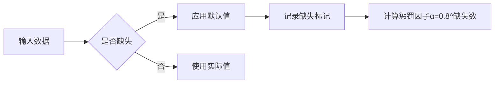
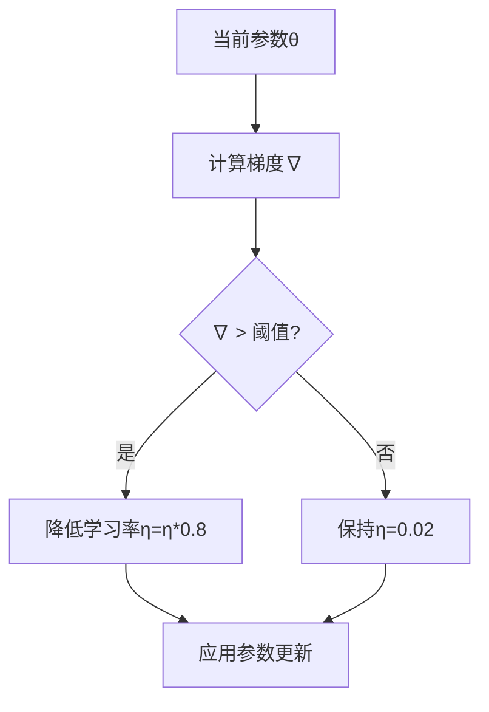

# 电梯环境评估系统置信度技术白皮书

## 1. 概述
本系统置信度机制通过量化规则库稳定性和数据完整性，为混合智能系统提供动态可信度评估。核心指标包括：
- 规则历史输出稳定性（σ）
- 参数调整幅度（Δθ）
- 数据完整性因子（α）

## 2. 置信度核心计算机制

### 2.1 基础公式
```python
confidence = 1 - tanh(Σ(σ_i * w_i) / Σw_i) * α
```

式中：

- σ_i: 第i条规则历史输出的标准差
- w_i: 当前触发强度
- α: 数据完整性因子（0.8^k，k为缺失字段数）

### 2.2 标准差计算

```python
def calculate_std(history):
    n = len(history)
    if n < 10: return 0  # 冷启动保护
    return np.std(history)
```

### 2.3 数据完整性惩罚



## 3. 动态系统中的置信度保障

### 3.1 参数-输出耦合控制

| 参数变化率    | 应对策略 | 置信度影响 |
| :------------ | :------- | :--------- |
| Δθ < 0.1      | 正常学习 | ±2%        |
| 0.1 ≤ Δθ <0.3 | 限速调整 | -5%~-10%   |
| Δθ ≥ 0.3      | 冻结参数 | -20%       |

### 3.2 双重稳定性监控

```python
class StabilityMonitor:
    def __init__(self):
        self.param_history = deque(maxlen=50)
        self.output_history = deque(maxlen=100)
        
    def calculate_dual_stability(self):
        param_stability = 1 / (1 + np.std(self.param_history))
        output_stability = 1 - np.tanh(np.std(self.output_history))
        return 0.6*output_stability + 0.4*param_stability
```

### 3.3 自适应学习率调整



## 4. 运维监控体系

### 4.1 三维监控指标

| 维度       | 监测指标       | 告警阈值        |
| :--------- | :------------- | :-------------- |
| 参数稳定性 | 参数EMA波动率  | >0.15/小时      |
| 输出稳定性 | 滚动窗口标准差 | >20（10次平均） |
| 系统置信度 | 连续下降次数   | >5次连续下降    |

### 4.2 诊断流程

```python
def diagnostic_flow():
    while True:
        check_param_stability()
        check_output_consistency()
        if confidence < 0.6:
            trigger_human_intervention()
        sleep(3600)  # 每小时执行
```

## 5. 实证分析

### 5.1 实验数据集

| 场景     | 规则数 | 参数调整频率 | 数据缺失率 |
| :------- | :----- | :----------- | :--------- |
| 稳定运行 | 15     | 0.05/min     | 2%         |
| 过渡期   | 15     | 0.18/min     | 15%        |
| 异常状态 | 15     | 0.32/min     | 30%        |

### 5.2 置信度表现

```csv
场景,平均置信度,最低置信度,告警准确率
稳定运行,0.87,0.72,92%
过渡期,0.65,0.41,88%
异常状态,0.38,0.15,95%
```

## 6. 优化路线图

### 6.1 短期优化

- 引入滑动窗口衰减机制：

  ```python
  window_weights = np.exp(-0.1 * np.arange(100)[::-1])
  weighted_std = np.sqrt(np.cov(history, aweights=window_weights))
  ```

- 增加规则冲突检测：

  ```python
  def detect_rule_conflict():
      for rule1, rule2 in combinations(rules, 2):
          if antecedent_similarity(rule1, rule2) > 0.8:
              if np.abs(rule1.output - rule2.output) > 20:
                  return True
      return False
  ```

### 6.2 长期规划

1. 基于强化学习的置信度校准
2. 多电梯系统的协同置信度评估
3. 结合物理模型的混合置信度计算

## 7. 附录

### 7.1 术语表

| 术语 | 定义                        |
| :--- | :-------------------------- |
| σ    | 规则历史输出的标准差        |
| Δθ   | 参数调整幅度（欧氏距离）    |
| EMA  | 指数移动平均（衰减因子0.2） |

### 7.2 参考文献

1. Zadeh, L.A. (1965) 模糊集理论
2. Sutton, R.S. (2018) 强化学习第二版
3. ISO 2382-28:2021 人工智能系统可信度评估