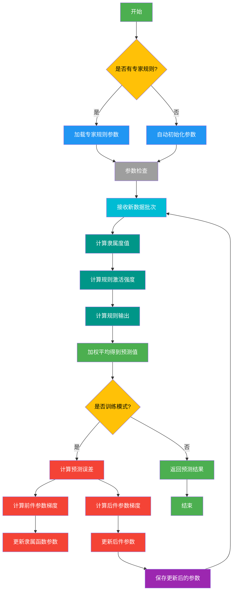
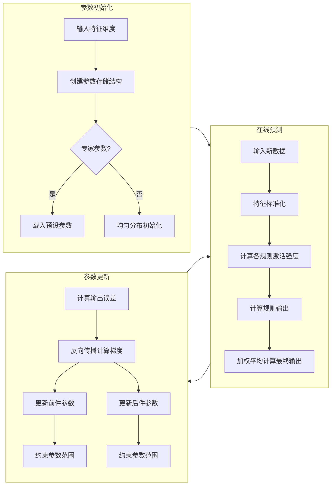

```mermaid
flowchart TD
    A[开始] --> B{是否有专家规则?}
    B -->|是| C[加载专家规则参数]
    B -->|否| D[自动初始化参数]
    C --> E[参数检查]
    D --> E
    E --> F[接收新数据批次]
    F --> G[计算隶属度值]
    G --> H[计算规则激活强度]
    H --> I[计算规则输出]
    I --> J[加权平均得到预测值]
    J --> K{是否训练模式?}
    K -->|是| L[计算预测误差]
    L --> M[计算前件参数梯度]
    M --> N[更新隶属函数参数]
    L --> O[计算后件参数梯度]
    O --> P[更新后件参数]
    P --> Q[保存更新后的参数]
    Q --> F
    K -->|否| R[返回预测结果]
    R --> S[结束] 
    style A fill:#4CAF50,color:white
style B fill:#FFC107,color:black
style C fill:#2196F3,color:white
style D fill:#2196F3,color:white
style E fill:#9E9E9E,color:white
style F fill:#00BCD4,color:white
style G fill:#009688,color:white
style H fill:#009688,color:white
style I fill:#009688,color:white
style J fill:#4CAF50,color:white
style K fill:#FFC107,color:black
style L fill:#F44336,color:white
style M fill:#F44336,color:white
style N fill:#F44336,color:white
style O fill:#F44336,color:white
style P fill:#F44336,color:white
style Q fill:#9C27B0,color:white
style R fill:#4CAF50,color:white
style S fill:#4CAF50,color:white
```

```mermaid
flowchart LR
    subgraph 参数初始化
        A1[输入特征维度] --> A2[创建参数存储结构]
        A2 --> A3{专家参数?}
        A3 -->|是| A4[载入预设参数]
        A3 -->|否| A5[均匀分布初始化]
    end
    
    subgraph 在线预测
        B1[输入新数据] --> B2[特征标准化]
        B2 --> B3[计算各规则激活强度]
        B3 --> B4[计算规则输出]
        B4 --> B5[加权平均计算最终输出]
    end
    
    subgraph 参数更新
        C1[计算输出误差] --> C2[反向传播计算梯度]
        C2 --> C3[更新前件参数]
        C2 --> C4[更新后件参数]
        C3 --> C5[约束参数范围]
        C4 --> C6[约束参数范围]
    end
    
    参数初始化 --> 在线预测
    在线预测 --> 参数更新
    参数更新 --> 在线预测
```