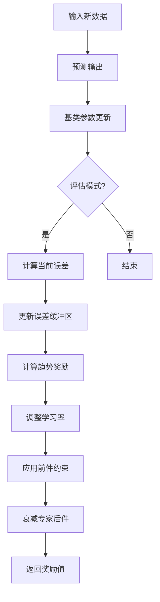

fuzzy2是在fuzzy1的基础上进行强化学习思想，对模型进行自适应在线更新

 flowchart LR    subgraph 参数初始化        A1[输入特征维度] --> A2[创建参数存储结构]        A2 --> A3{专家参数?}        A3 -->|是| A4[载入预设参数]        A3 -->|否| A5[均匀分布初始化]    end        subgraph 在线预测        B1[输入新数据] --> B2[特征标准化]        B2 --> B3[计算各规则激活强度]        B3 --> B4[计算规则输出]        B4 --> B5[加权平均计算最终输出]    end        subgraph 参数更新        C1[计算输出误差] --> C2[反向传播计算梯度]        C2 --> C3[更新前件参数]        C2 --> C4[更新后件参数]        C3 --> C5[约束参数范围]        C4 --> C6[约束参数范围]    end        参数初始化 --> 在线预测    在线预测 --> 参数更新    参数更新 --> 在线预测mermaid#mermaidChart1{font-family:sans-serif;font-size:16px;fill:var(--text-color);}#mermaidChart1 .error-icon{fill:#552222;}#mermaidChart1 .error-text{fill:#552222;stroke:#552222;}#mermaidChart1 .edge-thickness-normal{stroke-width:2px;}#mermaidChart1 .edge-thickness-thick{stroke-width:3.5px;}#mermaidChart1 .edge-pattern-solid{stroke-dasharray:0;}#mermaidChart1 .edge-pattern-dashed{stroke-dasharray:3;}#mermaidChart1 .edge-pattern-dotted{stroke-dasharray:2;}#mermaidChart1 .marker{fill:#333333;stroke:#333333;}#mermaidChart1 .marker.cross{stroke:#333333;}#mermaidChart1 svg{font-family:sans-serif;font-size:16px;}#mermaidChart1 .label{font-family:sans-serif;color:#333;}#mermaidChart1 .cluster-label text{fill:#333;}#mermaidChart1 .cluster-label span,#mermaidChart1 p{color:#333;}#mermaidChart1 .label text,#mermaidChart1 span,#mermaidChart1 p{fill:#333;color:#333;}#mermaidChart1 .node rect,#mermaidChart1 .node circle,#mermaidChart1 .node ellipse,#mermaidChart1 .node polygon,#mermaidChart1 .node path{fill:#ECECFF;stroke:#9370DB;stroke-width:1px;}#mermaidChart1 .flowchart-label text{text-anchor:middle;}#mermaidChart1 .node .katex path{fill:#000;stroke:#000;stroke-width:1px;}#mermaidChart1 .node .label{text-align:center;}#mermaidChart1 .node.clickable{cursor:pointer;}#mermaidChart1 .arrowheadPath{fill:#333333;}#mermaidChart1 .edgePath .path{stroke:#333333;stroke-width:2.0px;}#mermaidChart1 .flowchart-link{stroke:#333333;fill:none;}#mermaidChart1 .edgeLabel{background-color:#e8e8e8;text-align:center;}#mermaidChart1 .edgeLabel rect{opacity:0.5;background-color:#e8e8e8;fill:#e8e8e8;}#mermaidChart1 .labelBkg{background-color:rgba(232, 232, 232, 0.5);}#mermaidChart1 .cluster rect{fill:#ffffde;stroke:#aaaa33;stroke-width:1px;}#mermaidChart1 .cluster text{fill:#333;}#mermaidChart1 .cluster span,#mermaidChart1 p{color:#333;}#mermaidChart1 div.mermaidTooltip{position:absolute;text-align:center;max-width:200px;padding:2px;font-family:sans-serif;font-size:12px;background:hsl(80, 100%, 96.2745098039%);border:1px solid #aaaa33;border-radius:2px;pointer-events:none;z-index:100;}#mermaidChart1 .flowchartTitleText{text-anchor:middle;font-size:18px;fill:#333;}#mermaidChart1 :root{--mermaid-alt-font-family:sans-serif;}参数更新反向传播计算梯度计算输出误差更新前件参数更新后件参数约束参数范围约束参数范围在线预测特征标准化输入新数据计算各规则激活强度计算规则输出加权平均计算最终输出参数初始化是否创建参数存储结构输入特征维度专家参数?载入预设参数均匀分布初始化
