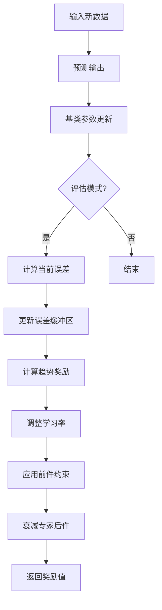

fuzzy2是在fuzzy1的基础上进行强化学习思想，对模型进行自适应在线更新

```mermaid
flowchart TD
    A[输入新数据] --> B[预测输出]
    B --> C[基类参数更新]
    C --> D{评估模式?}
    D -->|是| E[计算当前误差]
    E --> F[更新误差缓冲区]
    F --> G[计算趋势奖励]
    G --> H[调整学习率]
    H --> I[应用前件约束]
    I --> J[衰减专家后件]
    J --> K[返回奖励值]
    D -->|否| L[结束]
```

