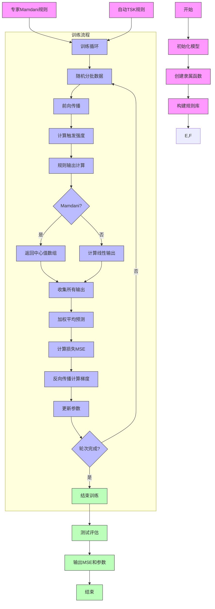

```mermaid
graph TD 
    classDef init fill:#f9f,stroke:#333;
    classDef train fill:#bbf,stroke:#333;
    classDef test fill:#bfb,stroke:#333;
    
    A[开始]:::init --> B
    B[初始化模型]:::init --> C
    C[创建隶属函数]:::init --> D
    D[构建规则库]:::init --> E,F
    E[专家Mamdani规则]:::init --> G
    F[自动TSK规则]:::init --> G
    
    subgraph 训练流程
        G[训练循环]:::train --> H
        H[随机分批数据]:::train --> I
        I[前向传播]:::train --> J
        J[计算触发强度]:::train --> K
        K[规则输出计算]:::train --> L
        L{Mamdani?}:::train -->|是| M
        L -->|否| N
        M[返回中心值数组]:::train --> O
        N[计算线性输出]:::train --> O
        O[收集所有输出]:::train --> P
        P[加权平均预测]:::train --> Q
        Q[计算损失MSE]:::train --> R
        R[反向传播计算梯度]:::train --> S
        S[更新参数]:::train --> T
        T{轮次完成?}:::train -->|否| H
        T -->|是| U
    end
    
    U[结束训练]:::test --> V
    V[测试评估]:::test --> W
    W[输出MSE和参数]:::test --> X
    X[结束]:::test
```