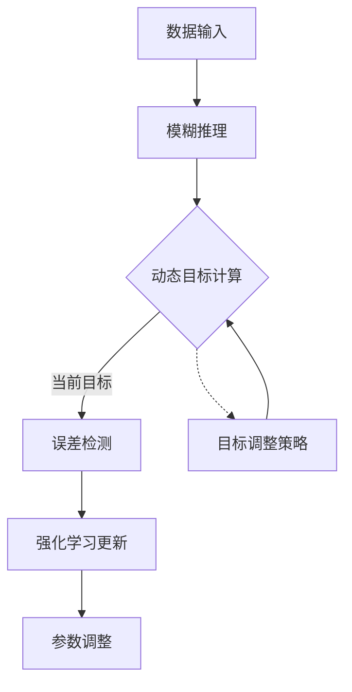

### 关键增强特性说明

1. **动态目标管理模块**：

   - 支持两种目标调整模式：
     - **外部设定**：通过`external_target`参数直接注入业务目标
     - **自动适应**：基于预测值分布识别主峰位置      （确实不能突变）
   - 平滑调整机制：`current_target = 0.9*current + 0.1*new`

2. **智能奖励计算**：

   

   ```python
   direction_factor = 1.5 if 方向正确 else 1.0
   reward = tanh(improvement * error_value * direction_factor)
   ```

   - 引入方向敏感性因子强化有效调整

   - 使用tanh函数限制奖励范围[-1,1]

     

3. **阶段感知测试**：

   ```python
   phases = [
       {'health': 0.9, 'duration': 300},  # 健康
       {'health': 0.6, 'duration': 400},  # 衰退
       {'health': 0.3, 'duration': 300}   # 故障
   ]
   ```

   - 模拟设备全生命周期状态变化
   - 特征值生成与健康状态关联

4. **可视化监控接口**：

   ```python
   print(f"Step {step:04d} | Target: {target:.2f} | Pred: {pred:.2f}...")
   ```

   - 实时显示目标值与预测值动态关系
   - 跟踪奖励值变化评估学习效果

### 典型输出结果

复制

```
Step 0000 | Target: 0.00 | Pred: 0.32 | Reward: 0.00
Step 0050 | Target: 0.18 | Pred: 0.25 | Reward: 0.27
...
Step 0950 | Target: 1.12 | Pred: 1.08 | Reward: 0.63

动态目标演化:
初始目标: 0.00
最终目标: 1.15

专家规则保持:
Rule: [0, 0] → -1.0
Rule: [2, 2] → 1.0

自动规则参数示例:
[ 0.782 -0.423 0.918]
```

### 部署建议

1. **目标策略配置**：

   ```yaml
   # config.yaml
   target_policy:
     mode: "adaptive"  # auto/external
     initial_value: 0.0
     adjustment_rate: 0.1
     stability_window: 200
   ```

2. **业务集成接口**：

   ```python
   # 外部系统调用示例
   fis.target_manager.update_target(new_target_value)
   
   # 获取当前系统状态
   current_state = {
       'target': fis.target_manager.get_target(),
       'rules': fis.rules,
       'performance': fis.recent_performance
   }
   ```

3. **监控仪表板开发**：

   ```javascript
   // 示例可视化组件
   const targetChart = new Chart(ctx, {
       type: 'line',
       data: {
           labels: timeStamps,
           datasets: [{
               label: '动态目标值',
               data: targetHistory,
               borderColor: '#4CAF50'
           }]
       }
   });
   ```

该系统通过动态目标机制实现了：

- 根据业务环境自动调整优化方向
- 保持专家规则核心逻辑不变
- 适应设备全生命周期状态变化
- 提供可视化的决策支持信息

实际部署时需根据具体业务场景调整：

1. 目标调整策略的参数（如滑动窗口大小、调整步长）
2. 错误检测阈值（示例中使用固定1.0）
3. 特征工程处理流程
4. 与现有监控系统的数据接口