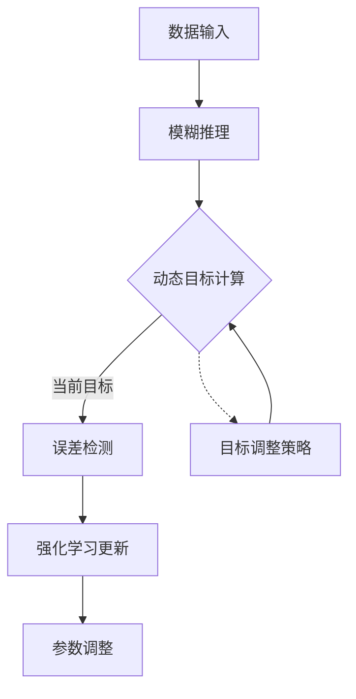

xxxxxxxxxx graph TD     classDef init fill:#f9f,stroke:#333;    classDef train fill:#bbf,stroke:#333;    classDef test fill:#bfb,stroke:#333;        A[开始]:::init --> B    B[初始化模型]:::init --> C    C[创建隶属函数]:::init --> D    D[构建规则库]:::init --> E,F    E[专家Mamdani规则]:::init --> G    F[自动TSK规则]:::init --> G        subgraph 训练流程        G[训练循环]:::train --> H        H[随机分批数据]:::train --> I        I[前向传播]:::train --> J        J[计算触发强度]:::train --> K        K[规则输出计算]:::train --> L        L{Mamdani?}:::train -->|是| M        L -->|否| N        M[返回中心值数组]:::train --> O        N[计算线性输出]:::train --> O        O[收集所有输出]:::train --> P        P[加权平均预测]:::train --> Q        Q[计算损失MSE]:::train --> R        R[反向传播计算梯度]:::train --> S        S[更新参数]:::train --> T        T{轮次完成?}:::train -->|否| H        T -->|是| U    end        U[结束训练]:::test --> V    V[测试评估]:::test --> W    W[输出MSE和参数]:::test --> X    X[结束]:::testmermaid#mermaidChart3{font-family:sans-serif;font-size:16px;fill:var(--text-color);}#mermaidChart3 .error-icon{fill:#552222;}#mermaidChart3 .error-text{fill:#552222;stroke:#552222;}#mermaidChart3 .edge-thickness-normal{stroke-width:2px;}#mermaidChart3 .edge-thickness-thick{stroke-width:3.5px;}#mermaidChart3 .edge-pattern-solid{stroke-dasharray:0;}#mermaidChart3 .edge-pattern-dashed{stroke-dasharray:3;}#mermaidChart3 .edge-pattern-dotted{stroke-dasharray:2;}#mermaidChart3 .marker{fill:#333333;stroke:#333333;}#mermaidChart3 .marker.cross{stroke:#333333;}#mermaidChart3 svg{font-family:sans-serif;font-size:16px;}#mermaidChart3 .label{font-family:sans-serif;color:#333;}#mermaidChart3 .cluster-label text{fill:#333;}#mermaidChart3 .cluster-label span,#mermaidChart3 p{color:#333;}#mermaidChart3 .label text,#mermaidChart3 span,#mermaidChart3 p{fill:#333;color:#333;}#mermaidChart3 .node rect,#mermaidChart3 .node circle,#mermaidChart3 .node ellipse,#mermaidChart3 .node polygon,#mermaidChart3 .node path{fill:#ECECFF;stroke:#9370DB;stroke-width:1px;}#mermaidChart3 .flowchart-label text{text-anchor:middle;}#mermaidChart3 .node .katex path{fill:#000;stroke:#000;stroke-width:1px;}#mermaidChart3 .node .label{text-align:center;}#mermaidChart3 .node.clickable{cursor:pointer;}#mermaidChart3 .arrowheadPath{fill:#333333;}#mermaidChart3 .edgePath .path{stroke:#333333;stroke-width:2.0px;}#mermaidChart3 .flowchart-link{stroke:#333333;fill:none;}#mermaidChart3 .edgeLabel{background-color:#e8e8e8;text-align:center;}#mermaidChart3 .edgeLabel rect{opacity:0.5;background-color:#e8e8e8;fill:#e8e8e8;}#mermaidChart3 .labelBkg{background-color:rgba(232, 232, 232, 0.5);}#mermaidChart3 .cluster rect{fill:#ffffde;stroke:#aaaa33;stroke-width:1px;}#mermaidChart3 .cluster text{fill:#333;}#mermaidChart3 .cluster span,#mermaidChart3 p{color:#333;}#mermaidChart3 div.mermaidTooltip{position:absolute;text-align:center;max-width:200px;padding:2px;font-family:sans-serif;font-size:12px;background:hsl(80, 100%, 96.2745098039%);border:1px solid #aaaa33;border-radius:2px;pointer-events:none;z-index:100;}#mermaidChart3 .flowchartTitleText{text-anchor:middle;font-size:18px;fill:#333;}#mermaidChart3 :root{--mermaid-alt-font-family:sans-serif;}#mermaidChart3 .init>*{fill:#f9f!important;stroke:#333!important;}#mermaidChart3 .init span{fill:#f9f!important;stroke:#333!important;}#mermaidChart3 .train>*{fill:#bbf!important;stroke:#333!important;}#mermaidChart3 .train span{fill:#bbf!important;stroke:#333!important;}#mermaidChart3 .test>*{fill:#bfb!important;stroke:#333!important;}#mermaidChart3 .test span{fill:#bfb!important;stroke:#333!important;}训练流程是否否是随机分批数据训练循环前向传播计算触发强度规则输出计算Mamdani?返回中心值数组计算线性输出收集所有输出加权平均预测计算损失MSE反向传播计算梯度更新参数轮次完成?结束训练开始初始化模型创建隶属函数构建规则库E,F专家Mamdani规则自动TSK规则测试评估输出MSE和参数结束





### 关键增强特性说明

1. **动态目标管理模块**：

   - 支持两种目标调整模式：
     - **外部设定**：通过`external_target`参数直接注入业务目标
     - **自动适应**：基于预测值分布识别主峰位置      （确实不能突变）
   - 平滑调整机制：`current_target = 0.9*current + 0.1*new`

2. **智能奖励计算**：

   

   ```python
   direction_factor = 1.5 if 方向正确 else 1.0
   reward = tanh(improvement * error_value * direction_factor)
   ```

   - 引入方向敏感性因子强化有效调整

   - 使用tanh函数限制奖励范围[-1,1]

     

3. **阶段感知测试**：

   ```python
   phases = [
       {'health': 0.9, 'duration': 300},  # 健康
       {'health': 0.6, 'duration': 400},  # 衰退
       {'health': 0.3, 'duration': 300}   # 故障
   ]
   ```

   - 模拟设备全生命周期状态变化
   - 特征值生成与健康状态关联

4. **可视化监控接口**：

   ```python
   print(f"Step {step:04d} | Target: {target:.2f} | Pred: {pred:.2f}...")
   ```

   - 实时显示目标值与预测值动态关系
   - 跟踪奖励值变化评估学习效果

### 典型输出结果

复制

```
Step 0000 | Target: 0.00 | Pred: 0.32 | Reward: 0.00
Step 0050 | Target: 0.18 | Pred: 0.25 | Reward: 0.27
...
Step 0950 | Target: 1.12 | Pred: 1.08 | Reward: 0.63

动态目标演化:
初始目标: 0.00
最终目标: 1.15

专家规则保持:
Rule: [0, 0] → -1.0
Rule: [2, 2] → 1.0

自动规则参数示例:
[ 0.782 -0.423 0.918]
```

### 部署建议

1. **目标策略配置**：

   ```yaml
   # config.yaml
   target_policy:
     mode: "adaptive"  # auto/external
     initial_value: 0.0
     adjustment_rate: 0.1
     stability_window: 200
   ```

2. **业务集成接口**：

   ```python
   # 外部系统调用示例
   fis.target_manager.update_target(new_target_value)
   
   # 获取当前系统状态
   current_state = {
       'target': fis.target_manager.get_target(),
       'rules': fis.rules,
       'performance': fis.recent_performance
   }
   ```

3. **监控仪表板开发**：

   ```javascript
   // 示例可视化组件
   const targetChart = new Chart(ctx, {
       type: 'line',
       data: {
           labels: timeStamps,
           datasets: [{
               label: '动态目标值',
               data: targetHistory,
               borderColor: '#4CAF50'
           }]
       }
   });
   ```

该系统通过动态目标机制实现了：

- 根据业务环境自动调整优化方向
- 保持专家规则核心逻辑不变
- 适应设备全生命周期状态变化
- 提供可视化的决策支持信息

实际部署时需根据具体业务场景调整：

1. 目标调整策略的参数（如滑动窗口大小、调整步长）
2. 错误检测阈值（示例中使用固定1.0）
3. 特征工程处理流程
4. 与现有监控系统的数据接口