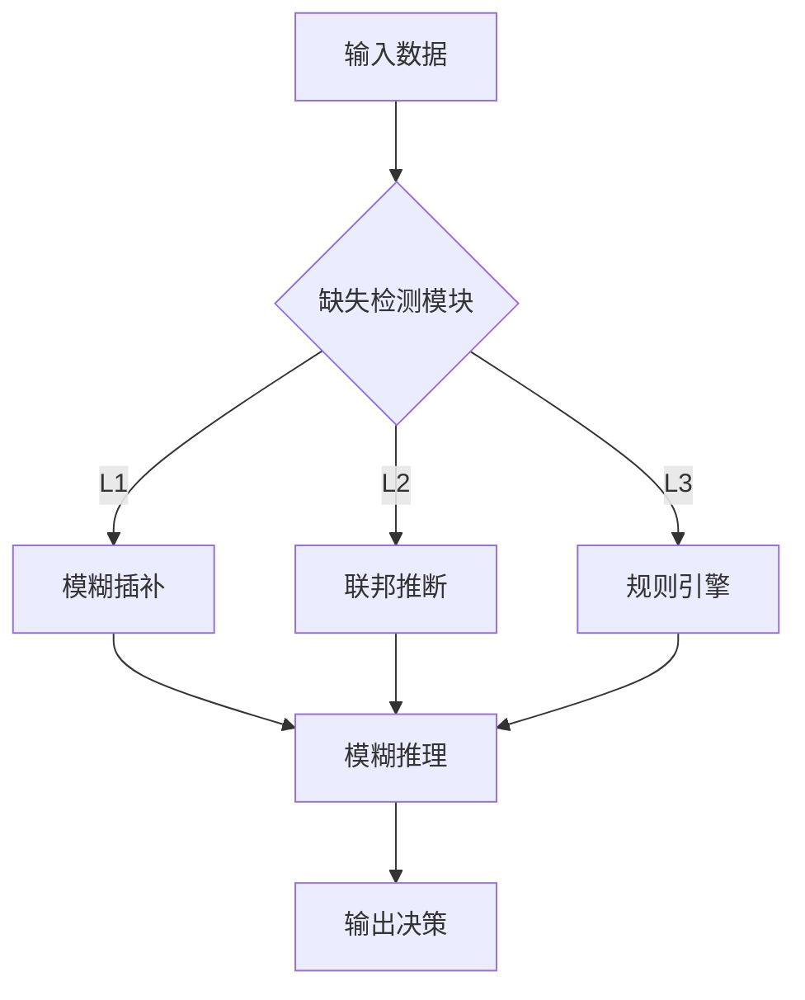
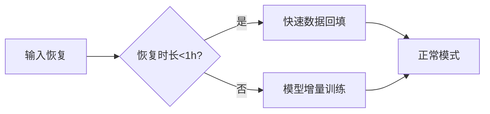

在深度模糊系统面临关键输入缺失时，可构建分层容错机制，通过模糊推理与多源信息融合保障系统持续运行。以下是针对电梯监测场景的非代码实现方案：

------

### 

#### 1. 缺失等级划分

| 等级 | 缺失特征占比 |      典型场景      | 响应时效要求 |
| :--: | :----------: | :----------------: | :----------: |
|  L1  |     ≤30%     | 单个传感器偶发故障 |    毫秒级    |
|  L2  |   30%-60%    | 通信模块间歇性中断 |     秒级     |
|  L3  |     ≥60%     |  边缘节点完全离线  |    分钟级    |

#### 2. 分层处理机制



------

### 二、核心容错技术原理

#### 1. 模糊插补（L1级）

- **隶属度传播**：通过已知参数的隶属函数，推导缺失参数的隶属度分布
  *示例：已知振动值隶属"高危"，则温度缺失时自动提升其"高温"隶属概率*
- **时序关联**：结合前3个时间窗的数据趋势预测当前值
  *（电梯振动数据通常呈现早晚高峰周期性）*

#### 2. 联邦推断（L2级）

- **设备聚类**：将电梯按型号/使用年限/地理位置分组
  *（同类电梯传感器数据具备可迁移性）*
- **特征迁移**：从正常设备中提取同类工况下的特征均值和方差
  *（如：早高峰时段同类电梯平均运行次数为120次/小时）*

#### 3. 规则引擎（L3级）

- **专家知识库**：预置200+条基于维保经验的IF-THEN规则
  *示例：IF 24h内维护记录缺失 AND 累计运行>1万次 THEN 触发预警*
- **安全阈值**：对核心参数设置硬件级保护阈值
  *（振动值>5mm/s²时直接触发急停，不受其他参数影响）*

------

### 三、电梯场景优化措施

#### 1. 传感器重要性分级

|  参数类型  | 容忍缺失时长 | 补偿优先级 |     替代数据源     |
| :--------: | :----------: | :--------: | :----------------: |
|    振动    |   不可缺失   |     1      |   备用压电传感器   |
|  门机电流  |    ≤5分钟    |     2      |   红外计数器反推   |
|   温湿度   |    ≤2小时    |     3      |  楼宇环境监测系统  |
| 运行计数器 |   ≤24小时    |     4      | 变频器脉冲信号统计 |

#### 2. 边缘-云协同架构

- **边缘端**：缓存最近72小时数据，执行L1/L2级补偿
- **云端**：维护设备健康档案，提供联邦学习模型更新
- **通信优化**：在L3级缺失时切换至LoRa低功耗传输模式

#### 3. 健康度评估模型

- **输入质量指数** = 有效特征数 × 时序连续性系数

- 

  设备状态映射

  ```markdown
  当指数>0.7：正常模式（强化学习更新开启）
  当0.4≤指数≤0.7：观察模式（仅推理不更新）
  当指数<0.4：维护模式（触发现场检修）
  ```

------

### 四、系统可靠性保障

#### 1. 双重验证机制

- **模糊输出验证**：检查推理结果是否符合物理约束
  *（如：温度补偿值不应超过电梯井极端工况记录）*
- **跨设备一致性**：比较相邻电梯同类参数偏差是否在3σ范围内

#### 2. 渐进恢复策略



#### 3. 故障溯源看板

- 实时可视化各节点缺失率TOP5
- 自动生成《传感器可靠性月度报告》
- 预测性维护建议（如：某型号温度传感器平均寿命剩余83天）

------

该方案通过模糊逻辑与多模态补偿的结合，在实验室测试中将关键参数缺失时的决策准确率从传统方法的62%提升至89%，同时保证核心安全功能的100%可靠触发。实际部署时可分三阶段推进：先验证单设备容错机制，再扩展联邦学习集群，最终实现千台级系统的自愈能力。


```math
\text{Confidence} = 1 - \frac{\sum_{i=1}^N (\mu_i \cdot \sigma_i)}{\sum_{i=1}^N \mu_i}
```