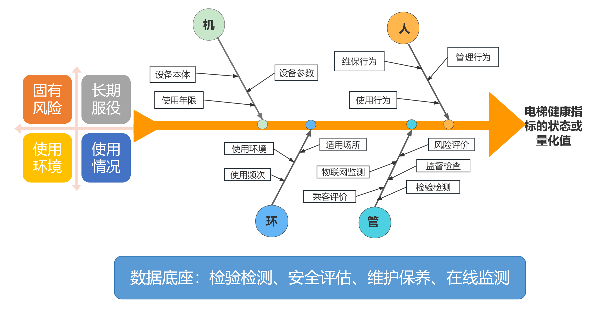

fuzzy文件夹是模糊控制系统的集合，考虑的方向和维度不同，如图所示

收集来的健康评价表的情况见document中的excel

其中本项目文件中对各个模糊子系统进行规定，如下
### fuzzy机：

| 一级 | 二级 | 三级 | 指标值 | 备注 |
| :--- | :--- | :--- | :--- | :--- |
| 机-电梯本体 | 设备参数 | 1.1.1 | 额定速度 | - |
|  |  | 1.1.2 | 额定载重量 | 实时确认 |
|  |  | 1.1.3 | 层站数 | 实时确认 |
|  | 使用年限 | - | 5年以内，5 - 14年，15年 - 19年，20年及以上 | 实时确认 |
|  | 设备本体 | 1.3.1 | 制造标准 | 87版，95版，03版，2020版 |
|  |  | 1.3.2 | 风险评价等级 | 1 - 4级，未评价 | 实时确认 |
|  |  | 1.3.3 | 驱动主机工作状态情况 | 实时监测 |
|  |  | 1.3.4 | 制动器工作状态情况 | 实时监测 |
|  |  | 1.3.5 | 轿门层门工作状态情况 | 实时监测 |
|  |  | 1.3.6 | 安全保护装置工作状态情况 | 实时监测 |
|  |  | 1.3.7 | 故障情况（次数） | 周期统计 |
|  |  | 1.3.7 | 隐患整改（完成/未完成） | 实时确认 | 

### fuzzy环：
| 输入指标名称 | 指标等级划分数 | 推荐隶属度函数 |
| --- | --- | --- |
| 使用场所 | 公共聚集场所与非公共聚集场所 | （该指标不影响健康度） |
| 使用频次（每日运行次数） | 特别高 | nd≥2000 |
|  | 非常高 | 1000≤nd＜2000 |
|  | 高 | 500≤nd＜1000 |
|  | 中等 | 200≤nd＜500 |
|  | 低 | 75≤nd＜200 |
|  | 非常低 | nd＜75 |
| 使用环境 | 特别恶劣 | 腐蚀环境，室外非全封闭井道 |
|  | 非常恶劣 | 长期处于高温、高湿环境，例如室外全封闭玻璃井道 |
|  | 较恶劣 | 室外全封闭非玻璃井道；井道和底坑长期渗漏水；机房无通风降温设施且夏季长期处于高温状态 |
|  | 一般 | 机房有通风设备且夏季偶尔出现高温；底坑偶有渗水 |
|  | 好 | 机房配有有效降温设备且保持机房温度不超过40℃，井道无渗漏水 | 

### fuzzy管：
| 输入指标名称 | 指标等级划分数 | 推荐隶属度函数 |
| --- | --- | --- |
| 风险评估结果 | 1-4级，未评价 | 1级最差 |
| 监督检查 | 有检查记录，问题数；没有检查记录 |  |
| 检验检测 | 没有不符合项 |  |
|  | 存在关键不符合项数量 | 这里是否可以考虑对一个一般不符合项赋0.3分，一个关键不符合项赋1分 |
|  | 存在一般不符合项数量（3个一般不符合项可以等效1个关键不符合项） |  |
| 乘客评价 | 1星-5星，无评价 | 3星为中等水平，1星最差，5星最好 |
| 物联网监测装置的配置情况 | 无 |  |
| （配置的物联网，可有效监测设备的运行情况，反馈出电梯的健康状况） | 其他 |  |
|  | 后装二级 |  |
|  | 前装二级 |  |
|  | 后装三级 |  |
|  | 前装三级 |  | 

### fuzzy人：
| 输入指标名称 | 指标等级划分数 | 推荐隶属度函数 |
| --- | --- | --- |
| 管理人员持证情况 | 有6年以上电梯安全管理经验（持安全管理员证满6年） |  |
|  | 有3 - 6年电梯安全管理经验（持安全管理员证满3年不满6年） |  |
|  | 有不满3年电梯安全管理经验（持安全管理员证不满3年） |  |
|  | 无安全管理员证 |  |
| 管理人员配置 | 该台电梯的电梯安全管理员所管理的电梯数量超过50台 |  |
|  | 该台电梯的电梯安全管理员所管理的电梯数量30 - 50台 |  |
|  | 该台电梯的电梯安全管理员所管理的电梯数量小于30台 |  |
| 日管控、周排查、月调度的落实情况 | 有效落实 | 以年为周期 |
|  | 偶尔出现未落实，例如一年未落实不超过3次 |  |
|  | 有时出现未落实，例如一年内未落实不超过10次 |  |
|  | 经常出现未落实，例如一年内未落实超过10次 |  |
| 检验检测超期情况 | 未出现过 |  |
|  | 出现过1 - 2次 |  |
|  | 出现超过2次 |  |
| 维保单位 | 原厂维保 |  |
|  | 原厂委托维保 |  |
|  | 非原厂或者原厂委托 |  |
| 维保单位信用情况 | 优或大于90分 |  |
|  | 良，80 - 89分 |  |
|  | 中，70 - 79分 |  |
|  | 一般，60 - 69分 |  |
|  | 差，低于60分 |  |
| 维保人员信用情况 | 优或大于90分 |  |
|  | 良，80 - 89分 |  |
|  | 中，70 - 79分 |  |
|  | 一般，60 - 69分 |  |
|  | 差，低于60分 |  |
| 维保超期情况 | 未出现过 | 以年为周期 |
|  | 出现过1次 |  |
|  | 出现超过2次 |  |
| 不文明行为 | 未出现过 | 以年为周期 |
|  | 出现不超过5次 |  |
|  | 出现过6 - 10次 |  |
|  | 出现过11 - 20次 |  |
|  | 出现超过20次 |  | 

| 一级指标 | 二级指标 | 三级指标 | 指标值 | 备注 |
| --- | --- | --- | --- | --- |
| 人-管理行为、维保行为、使用行为 | 3.2 管理 | 3.2.1 管理架构和管理人员数量 | 合理/不合理 | - |
|  |  | 3.2.2 日管控、周排查、月调度 | 是否落实 | 周期统计 |
|  |  | 3.2.3 检验检测超期 | 是否 | 周期统计 |
|  | 3.3 维保 | 3.3.1 维护保养单位 | 是否原厂维保 | 实时确认 |
|  |  | 3.3.2 维保单位信用 | 分数或等级 | 周期统计 |
|  |  | 3.3.3 维保人员信用 | 分数或等级 | 周期统计 |
|  |  | 3.3.4 维保超期 | 是否 | 周期统计 |
|  | 3.4 使用 | 3.4.1 不文明行为 | 次数 | 周期统计 | 